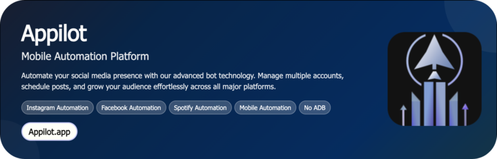

# YouTube Auto Thumbnail Generator

An advanced **YouTube Auto Thumbnail Generator** that automatically creates high-quality, engaging thumbnails from your uploaded videos. It uses smart frame extraction, customizable templates, and AI-driven visual enhancement to deliver optimized thumbnails that attract more clicks and improve engagement.

  

  &nbsp;
  &nbsp;
  &nbsp;
  

 
   Created by Appilot, built to showcase our approach to Automation! 
   <strong>If you are looking for custom YouTube Auto Thumbnail Generator, you've just found your team — Let’s Chat.👆👆</strong>

## Introduction

The **YouTube Auto Thumbnail Generator** automates the tedious process of thumbnail creation for YouTube videos. Instead of manually designing thumbnails, it captures high-quality frames from videos, applies filters, and uses templates to generate ready-to-upload thumbnails.

### Automating YouTube Thumbnail Creation

- Automatically captures the best frames from uploaded videos.  
- Integrates with AI-driven design templates for unique looks.  
- Enables consistent branding with color and logo presets.  
- Speeds up workflow for creators, agencies, and automation dashboards.  
- Delivers export-ready thumbnails with optimized aspect ratios.

## Core Features

| Feature | Description |
|----------|-------------|
| **Real Devices and Emulators** | Works seamlessly on both Android devices and emulators, capturing video frames in real-time. |
| **No-ADB Wireless Automation** | Uses Appilot’s wireless automation layer to trigger frame extraction without ADB connections. |
| **Mimicking Human Behavior** | Automates video navigation and frame selection in natural time intervals to resemble human actions. |
| **Multiple Accounts Support** | Generate thumbnails across multiple YouTube Studio accounts from one dashboard. |
| **Multi-Device Integration** | Manage and run parallel thumbnail generations across multiple Android devices. |
| **Exponential Growth for Your Account** | Boosts visibility through consistent, appealing thumbnails that increase CTR. |
| **Premium Support** | 24/7 technical assistance for setup, scaling, and troubleshooting. |

### Additional Features

| Feature | Description |
|----------|-------------|
| **Smart Frame Detection** | Automatically detects the most visually appealing frames using facial recognition and contrast analysis. |
| **Template Engine** | Customize text overlays, colors, and logos with reusable design presets. |
| **AI Enhancement** | Uses vision-based algorithms to enhance lighting, sharpness, and color balance. |
| **Batch Processing** | Process multiple videos simultaneously with scheduled execution. |
| **Auto Upload Integration** | Optionally auto-upload generated thumbnails via YouTube Studio automation API. |
| **Watermark Manager** | Apply or remove watermarks dynamically during thumbnail generation. |
| **Resolution Optimizer** | Ensures all thumbnails meet YouTube’s 1280x720 HD standards. |
| **Dynamic Text Layers** | Add automatic titles and branding with spintax text logic. |
| **Proxy + Session Isolation** | Maintain security and anonymity when working with multiple YouTube accounts. |
| **Error Handling & Logging** | Logs all activities for audit and re-runs, with retry logic for failed operations. |

  

## How It Works

1. **Input or Trigger** — The automation is triggered via the Appilot dashboard, where the user selects a video or playlist for thumbnail generation.  
2. **Core Logic** — The bot analyzes video frames using Appium or UI Automator, selects top candidates based on motion and brightness, and applies a pre-defined design template.  
3. **Output or Action** — It exports thumbnails in PNG/JPEG format, optionally auto-uploading them to the corresponding YouTube video.  
4. **Other Functionalities** — Includes error handling, parallel generation, and batch scheduling for multiple videos.  

## Tech Stack

**Language:** Python, Kotlin, JavaScript  
**Frameworks:** Appium, UI Automator, OpenCV, TensorFlow Lite  
**Tools:** Appilot, ADB, Scrcpy, Appium Inspector, Bluestacks, Firebase Test Lab  
**Infrastructure:** Cloud-based emulators, Dockerized render servers, proxy rotation, parallel task queue  

## Directory Structure

    youtube-auto-thumbnail-generator/
    │
    ├── src/
    │ ├── main.py
    │ ├── automation/
    │ │ ├── frame_extractor.py
    │ │ ├── template_engine.py
    │ │ ├── ai_enhancer.py
    │ │ └── utils/
    │ │ ├── logger.py
    │ │ ├── config_loader.py
    │ │ └── file_manager.py
    │
    ├── config/
    │ ├── templates/
    │ │ ├── default.yaml
    │ │ ├── gaming.yaml
    │ │ └── vlog.yaml
    │ ├── settings.yaml
    │ └── credentials.env
    │
    ├── logs/
    │ └── activity.log
    │
    ├── output/
    │ ├── thumbnails/
    │ └── report.csv
    │
    ├── requirements.txt
    └── README.md

## Use Cases

- **Creators** use it to auto-generate thumbnails for daily uploads, saving hours of editing time.  
- **Agencies** use it to create uniform branded thumbnails for client channels.  
- **Developers** integrate it into video automation workflows for content publishing pipelines.  
- **SMM Panels** use it to mass-generate thumbnails for content syndication systems.  

## FAQs

**How does it pick the best frame?**  
It uses OpenCV-based image scoring, detecting frames with optimal brightness, focus, and face visibility.

**Can I customize templates?**  
Yes, templates are modular and defined in YAML/JSON files — you can add your logo, color palette, and font.

**Does it support batch generation?**  
Absolutely — you can queue multiple videos and generate thumbnails simultaneously.

**Can it automatically upload thumbnails to YouTube?**  
Yes, when connected to Appilot or YouTube Studio API, it uploads directly after generation.

**Does it require a PC or phone?**  
Both options are supported — it can run on an Android device farm or emulated environment.

## Performance & Reliability Benchmarks

- **Execution Speed:** Generates thumbnails in 5–15 seconds per video (batch mode supported).  
- **Success Rate:** 95%+ success in automated generation and export.  
- **Scalability:** Supports 300–1,000 concurrent Android devices via Appilot task queues.  
- **Resource Efficiency:** Optimized frame analysis pipeline with minimal GPU usage.  
- **Error Handling:** Automatic retries, structured logging, and notification alerts for failed tasks.

##

